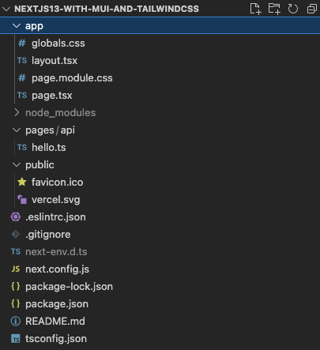
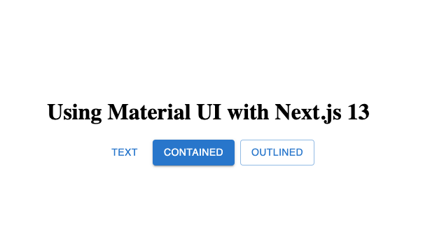
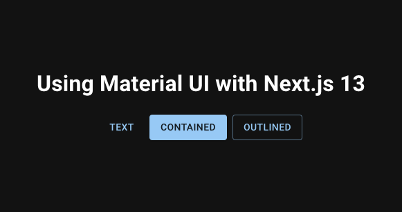
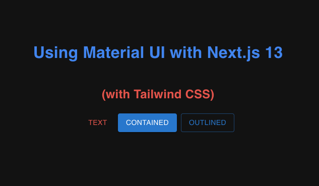

# Using Material UI with Next.js 13 and Tailwind CSS

Next.js 13 has been officially released to the public on October 25th, 2022. Many new features will make writing Next.js applications simpler. One of these is the introduction of the `app` folder and a new way of defining routes. This change will impact the integration of Material UI with Next.js. This article will present one approach for the integration of Material UI with Nest.js 13. I will present the details of each step and also integrate Tailwind CSS with MUI and Next.js.

## Prerequisites

To follow along with the code example here, you should have Node.js 14.6.0 or later installed in your system. You should also have some basic working knowledge of React, Next.js, and Material UI. Some basic understanding of Tailwind CSS would also be helpful.

## Create the Next.js application

We will use the `create-next-app` command to create our sample application to get started.

```bash showLineNumbers
npx create-next-app@latest --experimental-app nextjs13-with-mui-and-tailwindcss --typescript
```

The `--typescript` flag is used because we are using Typescript for our sample exercise.

The `--expermiental-app` flag is used here because the `app` folder feature is still experimental at this time. This command creates a new `nextjs13-with-mui-and-tailwindcss` folder for our sample application with the following files and folders:



## Delete the `pages` folder

For our sample exercise, we will not be working with the `pages` folder. So we will delete it.

## Install Material UI

The following command installs the packages required for Material UI. The `@emotion/react` and `@emotion/styled` are peer dependencies of Material UI.

```bash showLineNumbers
npm install @mui/material @emotion/react @emotion/styled
```

## Delete the content of `globals.css` and `page.module.css`

The content in the generated `globals.css` and `page.module.css` files will not be useful for our sample application. So we will delete the content in these files. We will update them later when necessary.

## Replace the content of the `page.tsx` file

With the necessary Material UI packages installed, we can add some MUI components to the `app/page.tsx` file. In the code below, we have added a Grid, a Stack, and 3 Buttons to the page.

```typescript showLineNumbers
"use client";
import { Button, Grid, Stack } from "@mui/material";
export default function Home() {
  return (
    <Grid container height="100vh" alignItems="center" justifyContent="center" direction="column">
      <h1>Using Material UI with Next.js 13</h1>
      <Stack direction="row" columnGap={1}>
        <Button variant="text">Text</Button>
        <Button variant="contained">Contained</Button>
        <Button variant="outlined">Outlined</Button>
      </Stack>
    </Grid>
  );
}
```

In addition to the MUI components, one important line in the file is the `use client` annotation statement. It is required to indicate to Next.js 13 that we intend this component to be a client component, i.e. to run in the browser. For additional information, please refer to the [Next.js 13 documentation](https://beta.nextjs.org/docs/rendering/server-and-client-components).

## Running the Sample Code

With the above changes, we are now ready to take the first drive of our application. The following command will start the application and listen on [http://localhost:3000](http://localhost:3000).

```
npm run dev
```

With your browser pointing to the above URL, you should see the screen looking like below.



This screen has a few issues. Readers with sharp eyes and familiar with Material Design probably would notice:

1. The font family used in the buttons is not the default Roboto font.
2. The title <i>Using Material UI with Next.js 13</i> also is not using the correct font.
   
Let’s correct these problems next!

## Include the Roboto font
To include special fonts to use in the application, we can update the `app/globals.css` as follows:

```css
@import url("https://fonts.googleapis.com/css?family=Roboto:300,400,500,700&display=swap");
@import url("https://fonts.googleapis.com/icon?family=Material+Icons");
```

These lines download the Roboto font and Material Icons (not used by the sample app) from Google.

## Apply MUI Theme

Next, we will create a dark theme for the sample app. We will create a new `app/theme/themes.ts` file and export the new theme as `darkTheme`.

```typescript
"use client";

import { createTheme } from "@mui/material/styles";

export const darkTheme = createTheme({
  palette: {
    mode: "dark",
  },
});
```

Now we have our custom theme and an updated CSS file with the correct font, we can apply it to our application. This can be done globally in the `app/layout.tsx` file.

```typescript showLineNumbers
"use client";

import "./globals.css";
import { darkTheme } from "./theme/themes";

import { ThemeProvider, CssBaseline } from "@mui/material";

export default function RootLayout({ children }: { children: React.ReactNode }) {
  return (
    <html lang="en">
      <head>
        <title>Create Next App</title>
        <meta name="description" content="Generated by create next app" />
        <link rel="icon" href="/favicon.ico" />
      </head>
      <ThemeProvider theme={darkTheme}>
        <CssBaseline />
        <body>{children}</body>
      </ThemeProvider>
    </html>
  );
}
```

1. The `use client` annotation tells Next.js 13 to render the component in the browser.
2. The `import {darkTheme}…` statement imports the custom theme we defined above to use for all pages using this layout.  Although we have only one in this simple application.
3. Next, we added the `<ThemeProvider />` component to apply the custom theme to pages using the layout.
4. The `<CssBaseline />` component applies the Material UI baseline styles and fonts for all components and HTML to the `children`.

When the above changes are applied correctly, the sample application should respond with the following screen when a browser visits [http://localhost:3000](http://localhost:3000).



Notice the screen is using the `darkTheme` and the Roboto font is being used in all elements.

Next, let’s take a look at how we can use Tailwind CSS with Next.js and Material UI.

## Motivation for Integration with Tailwind CSS
Material UI already provides many components for page layout and supports user interaction with applications using Material UI. But frequently, we need to make minor adjustments to MUI components' appearance or layout. This can be done using custom CSS classes or inline CSS which can become difficult to manage.

A better alternative for the custom styles is to use Tailwind CSS since the utility nature of the Tailwind classes minimized the need for defining new CSS classes and using inline styles.

## Install Tailwind CSS

The following command installs the `tailwindcss`, `postcss`, and `antoprefixer` needed to integrate Tailwind CSS with Next.js. For more information, see [Install Tailwind CSS with Next.js](https://tailwindcss.com/docs/guides/nextjs).

```
npm install -D tailwindcss postcss autoprefixer
```

Use the following comment to create `tailwind.config.js` and `postcss.config.js` configuration files.

```
npx tailwindcss init -p
```

No change to the `postcss.config.js` file is needed for our purpose.

```javascript
module.exports = {
  plugins: {
    tailwindcss: {},
    autoprefixer: {},
  },
};
```

For the `tailwind.config.js` file, we need to make 2 changes:

Remove the Tailwind CSS’s preflight style so it can use the MUI’s preflight instead (CssBaseline).
Add `./app/**/*.{js,ts,jsx,tsx,css}` to the content array so Tailwind CSS will include the files in the `app` folder in the CSS compilation process.

```javascript
/** @type {import('tailwindcss').Config} */
module.exports = {
  corePlugins: {
    preflight: false,
  },
  content: ["./app/**/*.{js,ts,jsx,tsx,css}"],
  theme: {
    extend: {},
  },
  plugins: [],
};
```

In the `app/globals.css` file, add the @tailwind directives for each of Tailwind’s layers.


```css
@tailwind base;
@tailwind components;
@tailwind utilities;

@import url("https://fonts.googleapis.com/css?family=Roboto:300,400,500,700&display=swap");
@import url("https://fonts.googleapis.com/icon?family=Material+Icons");
```

## Add Tailwind CSS classes to h1 and MUI Button

Finally, let’s update the `app/page.tsx` file to apply some Tailwind CSS styles to make some style changes so we can their effects.

```typescript showLineNumbers
"use client";

import { Button, Grid, Stack } from "@mui/material";

export default function Home() {
  return (
    <Grid container height="100vh" alignItems="center" justifyContent="center" direction="column">
      <h1 className="text-blue-500">Using Material UI with Next.js 13</h1>
      <h4 className="text-red-500">(with Tailwind CSS)</h4>
      <Stack direction="row" columnGap={1}>
        <Button variant="text" className="text-red-500">
          Text
        </Button>
        <Button variant="contained">Contained</Button>
        <Button variant="outlined">Outlined</Button>
      </Stack>
    </Grid>
  );
}
```

The final screen with the Tailwind CSS classes now looks like below. The title is displayed in blue. The new text in the `h4` and the text in the MUI `Button` are displayed in red.





## Some Final Thoughts
The new `app` folder introduced in Next.js 13 is still in beta. Even though some features are not finalized yet, many features are already functional. The sample application here focuses on a client-side library (Material UI) and requires the `use client` annotation.

Material UI offers a quick way to build a reasonably looking and consistent UI. With the combination of Tailwind CSS, My experience has been that the task of making fine-tuning adjustments to Material UI is easier since the need for defining new CSS classes and inline styles is minimized.

If you would like to check out the code described in this article, you can clone it from [Github](https://github.com/tatleung/nextjs13-with-mui-and-tailwindcss).
